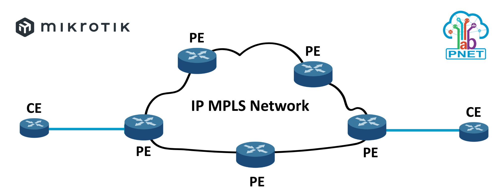

## Overview Lab

This MPLS lab runs on Proxmox and PNETLAB with specifications of 4Core CPU, 16GB RAM and 100GB Disk. It uses MikroTik CHRx86 6.49.18 running on PNETLAB.

<p align="center">

</p>

References Backup Lab : <a href="https://github.com/anggrdwjy/MPLS-lab.mikrotik-6.49.18/blob/main/Export_Lab_MPLS_MikroTik.zip">Backup Lab MPLS MikroTik</a>

## Topology Target

Topology Lab MPLS

<p align="center">

</p>

References Document : <a href="https://github.com/anggrdwjy/MPLS-lab.mikrotik-6.49.18/tree/main/Topology">Topology</a>

## Routing OSPFv2

OSPF (Open Shortest Path First) is a link-state routing protocol that allows routers to build a full map of the network topology to determine the fastest paths. It operates by discovering neighbors via Hello packets, exchanging Link-State Advertisements (LSAs) to synchronize a Link-State Database (LSDB), and running Dijkstra's Shortest Path First (SPF) algorithm.

This MPLS lab uses OSPFv2 routing

<p align="center">

</p>

References Document : <a href="https://github.com/anggrdwjy/MPLS-lab.mikrotik-6.49.18/tree/main/OSPFv2">Routing OSPFv2</a>

Verification OSPF Example

```
routing ospf export
routing ospf area print
routing ospf network print
routing ospf interface print 
routing ospf neighbor print
routing ospf route print
```

## MPLS LDP

Multi-Protocol Label Switching (MPLS) is an advanced packet-forwarding technique used in modern networks. Instead of making routers look into complex Layer 3 routing tables for every IP packet, MPLS uses labels for forwarding decisions. These labels create pre-defined, efficient paths across the network, which enhances speed, scalability and traffic management.

LDP is a protocol that automatically generates and exchanges labels between routers. Each router will locally generate labels for its prefixes and will then advertise the label values to its neighbors.

<p align="center">

</p>

References Document : <a href="https://github.com/anggrdwjy/MPLS-lab.mikrotik-6.49.18/tree/main/MPLS-LDP">MPLS LDP</a>

Verification MPLS LDP Example

```
mpls export
mpls interface print
mpls ldp interface print
mpls ldp neighbor print
mpls forwarding-table print
```

## MPLS L2VPN Virtual Private LAN Services

VPLS is an Ethernet-based point-to-multipoint Layer 2 VPN. It allows you to connect geographically dispersed Ethernet local area networks (LAN) sites to each other across an MPLS backbone. For customers who implement VPLS, all sites appear to be in the same Ethernet LAN even though traffic travels across the service provider's network.

VPLS, in its implementation and configuration, has much in common with a Layer 2 VPN. In VPLS, a packet originating within a service provider customer’s network is sent first to a customer edge (CE) device (for example, a router or Ethernet switch). It is then sent to a provider edge (PE) router within the service provider’s network. The packet traverses the service provider’s network over a MPLS label-switched path (LSP). It arrives at the egress PE router, which then forwards the traffic to the CE device at the destination customer site.

<p align="center">

</p>

References Document : <a href="https://github.com/anggrdwjy/MPLS-lab.mikrotik-6.49.18/tree/main/L2VPN-VPLS">MPLS L2VPN VPLS</a>

Verification VPLS Example

```
interface vpls export
interface vpls print
interface bridge port export
interface bridge print
interface bridge host print
mpls ldp neighbor print brief
```

## IBGP Router Reflector Concept

A BGP Route Reflector (RR) reduces iBGP full-mesh requirements by acting as a central hub that "reflects" routes between client routers within an Autonomous System (AS). It breaks the split-horizon rule (iBGP-to-iBGP), allowing clients to peer only with the RR, simplifying configuration and reducing CPU/network overhead.

Router Reflector (RR1)

<p align="center">

</p>

Router Reflector (RR2)

<p align="center">

</p>

References Document : <a href="https://github.com/anggrdwjy/MPLS-lab.mikrotik-6.49.18/tree/main/IBGP-RouteReflector">IBGP ROUTE REFLECTOR</a>

Verification IBGP Example

```
routing bgp export
routing bgp instance print
routing bgp peer print
```

## MPLS L3VPN Virtual Routing Forwarding

L3VPN in BGP (specifically BGP/MPLS IP VPN) works by using Multiprotocol BGP (MP-BGP) to distribute customer routes between Provider Edge (PE) routers, while using MPLS to tunnel traffic across the backbone. PE routers use VRFs to maintain separate routing tables per customer, assign Route Distinguishers (RDs) to make routes unique, and use Route Targets (RTs) to control route import/export

<p align="center">

</p>

References Document : <a href="https://github.com/anggrdwjy/MPLS-lab.mikrotik-6.49.18/tree/main/L3VPN-VRF">MPLS L3VPN VRF</a>

Verification L3VPN VRF Example

```
ip address print
interface bridge port export
interface bridge print
ip route vrf export
ip route vrf print brief
routing bgp vpnv4-route print
```

## Verification with Script

Example Verification (Traceroute)

<p align="center">

</p>

References Document : <a href="https://github.com/anggrdwjy/MPLS-lab.mikrotik-6.49.18/tree/main/Verification">Verification with Script</a>

Step Verification via SecureCRT

  1. Click File -> Log Session -> Rename File -> Save (Create Log)
  2. Script Run -> Select Filename "verification.vbs" -> Run (Running Script)
  3. Click File -> Log Session (Stop Log)

Script Verification (VBS Script)

```
# $language = "VBScript"
# $interface = "1.0"

'==========================================================================
' Below is the real deal - the real programmer
' NAME: Cisco Password Changer
' AUTHOR: Brian Desmond
' DATE  : 2/22/2006
' UPDATED: 9/4/2006 - Added password only detection
' Above is the real man - the real engineer
'==========================================================================

Sub Main
	Const DEVICE_FILE_PATH = "verification.txt" //EDIT_PATH_FILE
	Const TERM_PROMPT = "PE1"
	
	Dim fso
	Dim fdevice
	Dim fcommand
	Dim foutput

	
	Dim devname
	Dim devtype
	Dim ldevice
	Dim lcommand
	Dim filestr
	Dim str
	Dim index
	Dim prompt_init
	Dim prompt_enabled
	Dim term_no_length
	Dim ping_result
	
	set fso = CreateObject("Scripting.FileSystemObject")
	set fdevice = fso.OpenTextFile(DEVICE_FILE_PATH)
	crt.Screen.Synchronous = True
	
	While Not fdevice.AtEndOfStream
		prompt_enabled = "#"
		filestr = ""
		ldevice = fdevice.ReadLine
		devname = ldevice					'Split(ldevice, ";")(0)
		'set foutput = fso.OpenTextFile(devname & ".txt", 2, True)
		'devtype = Split(ldevice, ";")(1)
		
		crt.Screen.Send "" & devname & vbCr
		crt.Screen.WaitForString prompt_enabled
	wend
	fdevice.Close
	

End Sub

```

## Support

* [:octocat: Follow me on GitHub](https://github.com/anggrdwjy)
* [🔔 Subscribe me on Youtube](https://www.youtube.com/@anggarda.wijaya)


### Bugs

Please open an issue on GitHub with as much information as possible if you found a bug.
* Your Proxmox and PNETLAB Version
* All the logs and message outputted
* etc
