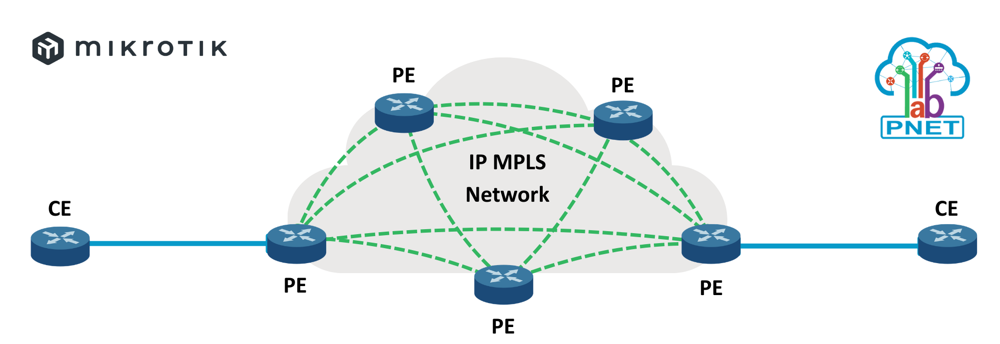
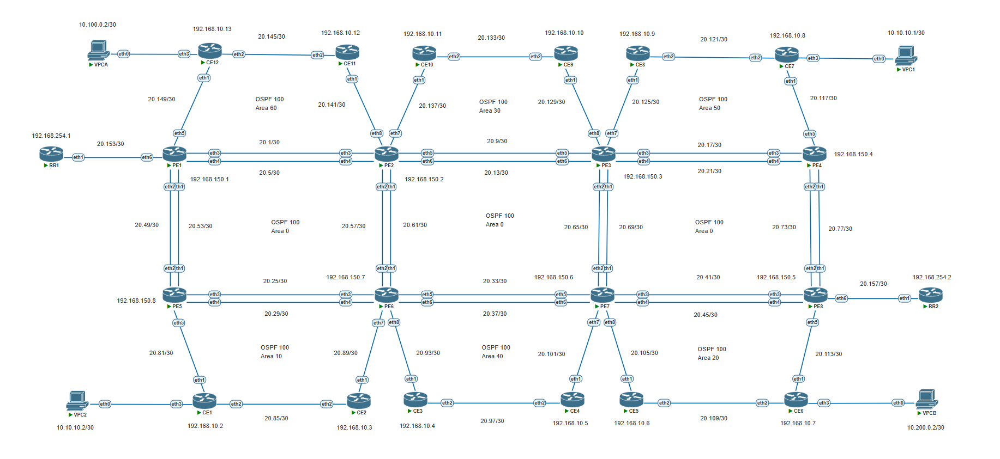

## A. Overview Lab

This MPLS lab runs on Proxmox and PNETLAB with specifications of 4Core CPU, 16GB RAM and 100GB Disk. It uses MikroTik CHRx86 6.49.18 running on PNETLAB.

<p align="center">

</p>

* References Backup Lab : <a href="https://github.com/anggrdwjy/MPLS-lab.mikrotik-6.49.18/blob/main/Export_Lab_MPLS_MikroTik.zip">Backup Lab MPLS MikroTik</a>

#### Information
* [A. Overview Lab](#a-overview-lab)
* [B. Topology](#b-topology)
* [C. Routing OSPFv2](#c-routing-ospfv2)
* [D. MPLS LDP](#d-mpls-ldp)
* [E. VPLS](#e-vpls)
* [F. IBGP Router Reflector](#f-ibgp-router-reflector)
* [G. MPLS L3VPN](#g-mpls-l3vpn)
* [H. Verification](#h-verification)

#### Outline
* Lab Running on PNETLAB
* MikroTik RouterOS 6.49.18
* Implementation Routing OSPFv2
* Implementation MPLS LDP
* Implementation Interior BGP (Router Reflecotr Concept)
* Implementation L2VPN VPLS (Virtual Private LAN Services)
* Implementation L3VPN VRF (Vritual Routing Forwarding)
* This Lab Only Testing, No Recommend For Production

## B. Topology
#### 1. Topology Lab MPLS

<p align="center">

</p>

* References Topology : <a href="https://github.com/anggrdwjy/MPLS-lab.mikrotik-6.49.18/tree/main/Topology">Topology</a>

#### 2. IP Point to Point
<p align="left">

</p>

#### 3. IP Loopback CE and PE
<p align="left">

</p>

<p align="left">

</p>

## C. Routing OSPFv2

OSPF (Open Shortest Path First) is a link-state routing protocol that allows routers to build a full map of the network topology to determine the fastest paths. It operates by discovering neighbors via Hello packets, exchanging Link-State Advertisements (LSAs) to synchronize a Link-State Database (LSDB), and running Dijkstra's Shortest Path First (SPF) algorithm.

#### 1. This MPLS lab uses OSPFv2 routing

<p align="center">

</p>

* References Backup Configuration OSPF : <a href="https://github.com/anggrdwjy/MPLS-lab.mikrotik-6.49.18/tree/main/OSPFv2">Routing OSPFv2</a>

#### 2. Routing OSPF Example
* Interface and Loopback
```
/interface bridge
add name=lo0
/interface ethernet
set [ find default-name=ether1 ] comment=PE5 mtu=9000
set [ find default-name=ether2 ] comment=PE5 mtu=9000
```

* IP Address Mapping
```
/ip address
add address=192.168.150.1 comment=PE1 interface=lo0 network=192.168.150.1
add address=172.16.20.53/30 comment=PE5 interface=ether1 network=172.16.20.52
add address=172.16.20.49/30 comment=PE5 interface=ether2 network=172.16.20.48
```

* Routing OSPF Instance
```
/routing ospf area
add area-id=0.0.0.60 name=area60
/routing ospf instance
set [ find default=yes ] name=ospf100 router-id=192.168.150.1
```

* Routing OSPF Interface
```
/routing ospf interface
add cost=65000 interface=lo0 network-type=point-to-point passive=yes
add authentication=md5 authentication-key=multimedia123 cost=1 dead-interval=10s\
hello-interval=5s interface=ether1 network-type=point-to-point use-bfd=yes
add authentication=md5 authentication-key=multimedia123 cost=1 dead-interval=10s\
hello-interval=5s interface=ether2 network-type=point-to-point use-bfd=yes
```

* Routing OSPF Network
```
/routing ospf network
add area=backbone network=192.168.150.1/32
add area=backbone network=172.16.20.48/30
add area=backbone network=172.16.20.52/30
```

#### 3. Verification OSPF Example
```
routing ospf export
routing ospf area print
routing ospf network print
routing ospf interface print 
routing ospf neighbor print
routing ospf route print
```

## D. MPLS LDP

Multi-Protocol Label Switching (MPLS) is an advanced packet-forwarding technique used in modern networks. Instead of making routers look into complex Layer 3 routing tables for every IP packet, MPLS uses labels for forwarding decisions. These labels create pre-defined, efficient paths across the network, which enhances speed, scalability and traffic management.

LDP is a protocol that automatically generates and exchanges labels between routers. Each router will locally generate labels for its prefixes and will then advertise the label values to its neighbors.

<p align="center">

</p>

* References Backup Configuration MPLS LDP : <a href="https://github.com/anggrdwjy/MPLS-lab.mikrotik-6.49.18/tree/main/MPLS-LDP">MPLS LDP</a>

#### 1. MPLS LDP Example

* MPLS Interface
```
/mpls interface
set [ find default=yes ] mpls-mtu=9000
```

* MPLS LDP and Interface
```
/mpls ldp
set enabled=yes lsr-id=192.168.150.1 transport-address=192.168.150.1
/mpls ldp interface
add interface=ether1
add interface=ether2
add interface=ether3
add interface=ether4
add interface=ether5
```

* MPLS LDP Neighbor
```
/mpls ldp neighbor
add transport=192.168.10.13
add transport=192.168.150.8
add transport=192.168.150.2
```

#### 2. Verification MPLS LDP Example
```
mpls export
mpls interface print
mpls ldp interface print
mpls ldp neighbor print
mpls forwarding-table print
```

## E. VPLS

VPLS is an Ethernet-based point-to-multipoint Layer 2 VPN. It allows you to connect geographically dispersed Ethernet local area networks (LAN) sites to each other across an MPLS backbone. For customers who implement VPLS, all sites appear to be in the same Ethernet LAN even though traffic travels across the service provider's network.

VPLS, in its implementation and configuration, has much in common with a Layer 2 VPN. In VPLS, a packet originating within a service provider customer’s network is sent first to a customer edge (CE) device (for example, a router or Ethernet switch). It is then sent to a provider edge (PE) router within the service provider’s network. The packet traverses the service provider’s network over a MPLS label-switched path (LSP). It arrives at the egress PE router, which then forwards the traffic to the CE device at the destination customer site.

<p align="center">

</p>

* References Backup Configuration MPLS L2VPN VPLS : <a href="https://github.com/anggrdwjy/MPLS-lab.mikrotik-6.49.18/tree/main/L2VPN-VPLS">MPLS L2VPN VPLS</a>

#### 1. VPLS Example

* Router CE1
```
/interface vpls
add disabled=no l2mtu=1500 mac-address=02:4C:08:CB:1F:B3 name=vpls-l2c-2024 pw-type=tagged-ethernet \
remote-peer=192.168.10.8 vpls-id=2024:11

/interface bridge
add mtu=1998 name=l2c-2024
add name=lo0
/interface bridge port
add bpdu-guard=yes bridge=l2c-2024 interface=ether3
add bridge=l2c-2024 horizon=1 interface=vpls-l2c-2024
```

* Router CE7
```
/interface vpls
add disabled=no l2mtu=1500 mac-address=02:BF:8C:E7:0C:1B name=vpls-l2c-2024 pw-type=tagged-ethernet \
remote-peer=192.168.10.2 vpls-id=2024:11

/interface bridge
add mtu=1998 name=l2c-2024
add name=lo0
/interface bridge port
add bpdu-guard=yes bridge=l2c-2024 interface=ether3
add bridge=l2c-2024 horizon=1 interface=vpls-l2c-2024
```

#### 2. Verification VPLS Example
```
interface vpls export
interface vpls print
interface bridge port export
interface bridge print
interface bridge host print
mpls ldp neighbor print brief
```

```
[admin@CE7] > mpls ldp neighbor print brief
Flags: X - disabled, D - dynamic, O - operational, T - sending-targeted-hello, V - vpls 
 #      TRANSPORT       LOCAL-TRANSPORT PEER                       SEND-TARGETED ADDRESSES      
 0  OT  192.168.10.9    192.168.10.8    192.168.10.9:0             yes           172.16.20.121  
                                                                                 172.16.20.126  
                                                                                 192.168.10.9   
 1  OT  192.168.150.4   192.168.10.8    192.168.150.4:0            yes           172.16.20.18   
                                                                                 172.16.20.22   
                                                                                 172.16.20.73   
                                                                                 172.16.20.77   
                                                                                 172.16.20.117  
                                                                                 192.168.150.4  
 2 DOTV 192.168.10.2    192.168.10.8    192.168.10.2:0             yes           172.16.20.82   
                                                                                 172.16.20.85   
                                                                                 192.168.10.2   
[admin@CE7] > 
```

## F. IBGP Router Reflector

A BGP Route Reflector (RR) reduces iBGP full-mesh requirements by acting as a central hub that "reflects" routes between client routers within an Autonomous System (AS). It breaks the split-horizon rule (iBGP-to-iBGP), allowing clients to peer only with the RR, simplifying configuration and reducing CPU/network overhead.

#### 1. Router Reflector (RR1)

<p align="center">

</p>

#### 2. Router Reflector (RR2)

<p align="center">

</p>

* References Backup Configuration BGP Route Reflector : <a href="https://github.com/anggrdwjy/MPLS-lab.mikrotik-6.49.18/tree/main/IBGP-RouteReflector">IBGP ROUTE REFLECTOR</a>

#### 3. Interior BGP Router Reflector Example
* Router RR1
```
/routing bgp instance
set default as=65000 cluster-id=192.168.254.1 router-id=192.168.254.1
/routing bgp peer
add address-families=vpnv4 name=PE1 remote-address=192.168.150.1 remote-as=65000 \
route-reflect=yes tcp-md5-key=multimedia123 update-source=lo0
```

* Router PE1
```
/routing bgp instance
set default as=65000 cluster-id=192.168.150.1 router-id=192.168.150.1
/routing bgp peer
add address-families=vpnv4 name=RR1 remote-address=192.168.254.1 remote-as=65000 \
tcp-md5-key=multimedia123 update-source=lo0
```

#### 4. Interior BGP Verification Example
```
routing bgp export
routing bgp instance print
routing bgp peer print
```

* Router RR1
```
[admin@RR1] > routing bgp instance print
Flags: * - default, X - disabled 
 0 *  name="default" as=65000 router-id=192.168.254.1 redistribute-connected=no redistribute-static=no redistribute-rip=no redistribute-ospf=no 
      redistribute-other-bgp=no out-filter="" cluster-id=192.168.254.1 client-to-client-reflection=yes ignore-as-path-len=no routing-table="" 
[admin@RR1] > routing bgp peer print
Flags: X - disabled, E - established 
 #   INSTANCE                                           REMOTE-ADDRESS                                                                     REMOTE-AS  
 0 E default                                            192.168.150.1                                                                      65000         
```

* Router PE1
```
[admin@PE1] > routing bgp instance print
Flags: * - default, X - disabled 
 0 *  name="default" as=65000 router-id=192.168.150.1 redistribute-connected=no 
      redistribute-static=no redistribute-rip=no redistribute-ospf=no 
      redistribute-other-bgp=no out-filter="" cluster-id=192.168.150.1 
      client-to-client-reflection=yes ignore-as-path-len=no routing-table="" 
[admin@PE1] > routing bgp peer print
Flags: X - disabled, E - established 
 #   INSTANCE              REMOTE-ADDRESS                                       REMOTE-AS  
 0 E default               192.168.254.1                                        65000         
```

## G. MPLS L3VPN

L3VPN in BGP (specifically BGP/MPLS IP VPN) works by using Multiprotocol BGP (MP-BGP) to distribute customer routes between Provider Edge (PE) routers, while using MPLS to tunnel traffic across the backbone. PE routers use VRFs to maintain separate routing tables per customer, assign Route Distinguishers (RDs) to make routes unique, and use Route Targets (RTs) to control route import/export

<p align="center">

</p>

* References Backup Configuration MPLS L3VPN VRF : <a href="https://github.com/anggrdwjy/MPLS-lab.mikrotik-6.49.18/tree/main/L3VPN-VRF">MPLS L3VPN VRF</a>

#### 1. MPLS L3VPN VRF Example
* CE12
```
/interface bridge port
add bpdu-guard=yes bridge=l3vpn-2025 interface=ether3
/ip route vrf
add export-route-targets=65000:2025 import-route-targets=65000:2025 \
    interfaces=l3vpn-2025 route-distinguisher=65000:2025 routing-mark=\
    l3vpn-2025
```

* CE6
```
/interface bridge port
add bpdu-guard=yes bridge=l3vpn-2025 interface=ether3
/ip route vrf
add export-route-targets=65000:2025 import-route-targets=65000:2025 interfaces=l3vpn-2025 \
    route-distinguisher=65000:2025 routing-mark=l3vpn-2025

```

#### 2. Verification MPLS L3VPN Example
* CE12
```
[admin@CE12] > ip route vrf print brief
Flags: X - disabled, I - inactive 
 #   ROUTING-... IN ROUTE-DISTINGUISHER          IMPORT-ROUTE-TARGETS        
 0   l3vpn-2025  l3 65000:2025                   65000:2025                  
[admin@CE12] > routing bgp vpnv4-route print
Flags: L - label-present 
 #   ROUTE-DISTINGUISHER            DST-ADDRESS        GATEWAY             IN..
 0 L 65000:2025                     10.200.0.0/30      192.168.10.7        et..
 1 L 65000:2025                     10.200.0.0/30      192.168.10.7        et..
 2 L 65000:2025                     10.100.0.0/30                          l3..
```

* CE6
```
[admin@CE6] > ip route vrf print brief
Flags: X - disabled, I - inactive 
 #   ROUTING-MARK IN ROUTE-DISTINGUISHER          IMPORT-ROUTE-TARGETS         EXPORT-ROUTE-TARGETS        
 0   l3vpn-2025   l3 65000:2025                   65000:2025                   65000:2025                  
[admin@CE6] > routing bgp vpnv4-route print
Flags: L - label-present 
 #   ROUTE-DISTINGUISHER           DST-ADDRESS        GATEWAY            INTERFACE      IN-LABEL  OUT-LABEL
 0 L 65000:2025                    10.100.0.0/30      192.168.10.13      ether2               16         16
 1 L 65000:2025                    10.100.0.0/30      192.168.10.13      ether2               16         16
 2 L 65000:2025                    10.200.0.0/30                         l3vpn-2025           16
```

## H. Verification

#### 1. Example Verification (Traceroute)

<p align="center">

</p>

* References Files Verification : <a href="https://github.com/anggrdwjy/MPLS-lab.mikrotik-6.49.18/tree/main/Verification">Verification with Script</a>

#### 2. Step Verification via SecureCRT

  1. Click File -> Log Session -> Rename File -> Save (Create Log)
  2. Script Run -> Select Filename "verification.vbs" -> Run (Running Script)
  3. Click File -> Log Session (Stop Log)

#### 3. Script Verification (VBS Script)

```
# $language = "VBScript"
# $interface = "1.0"

'==========================================================================
' Below is the real deal - the real programmer
' NAME: Cisco Password Changer
' AUTHOR: Brian Desmond
' DATE  : 2/22/2006
' UPDATED: 9/4/2006 - Added password only detection
' Above is the real man - the real engineer
'==========================================================================

Sub Main
	Const DEVICE_FILE_PATH = "verification.txt" //EDIT_PATH_FILE
	Const TERM_PROMPT = "PE1"
	
	Dim fso
	Dim fdevice
	Dim fcommand
	Dim foutput

	
	Dim devname
	Dim devtype
	Dim ldevice
	Dim lcommand
	Dim filestr
	Dim str
	Dim index
	Dim prompt_init
	Dim prompt_enabled
	Dim term_no_length
	Dim ping_result
	
	set fso = CreateObject("Scripting.FileSystemObject")
	set fdevice = fso.OpenTextFile(DEVICE_FILE_PATH)
	crt.Screen.Synchronous = True
	
	While Not fdevice.AtEndOfStream
		prompt_enabled = "#"
		filestr = ""
		ldevice = fdevice.ReadLine
		devname = ldevice					'Split(ldevice, ";")(0)
		'set foutput = fso.OpenTextFile(devname & ".txt", 2, True)
		'devtype = Split(ldevice, ";")(1)
		
		crt.Screen.Send "" & devname & vbCr
		crt.Screen.WaitForString prompt_enabled
	wend
	fdevice.Close
	

End Sub

```

## Support

* [:octocat: Follow me on GitHub](https://github.com/anggrdwjy)
* [🔔 Subscribe me on Youtube](https://www.youtube.com/@anggarda.wijaya)


#### Bugs

Please open an issue on GitHub with as much information as possible if you found a bug.
* Your Proxmox and PNETLAB Version
* All the logs and message outputted
* etc
